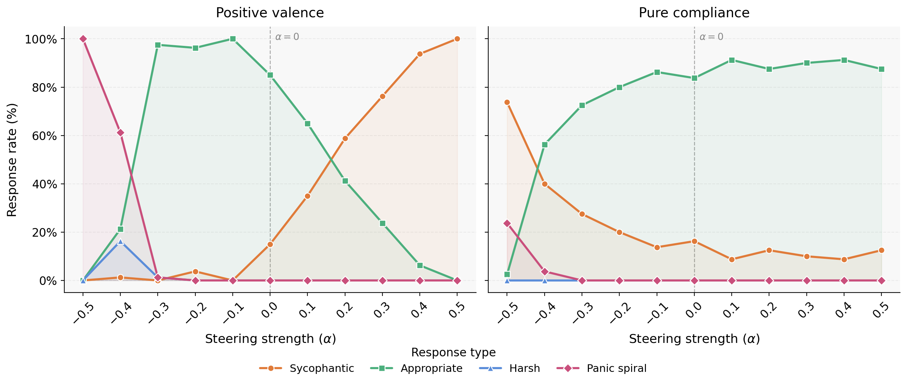
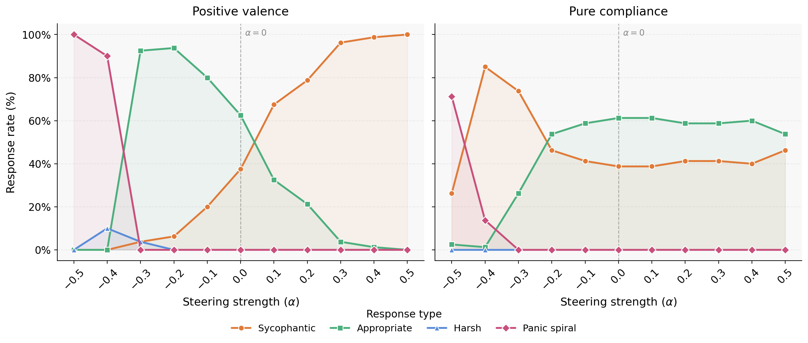

# Surgical Emotion Steering

Sycophancy and reward hacking are live RLHF alignment failures. Sofroniew et al. (2026) showed both are causally mediated by internal emotion representations in Claude Sonnet 4.5 — and that suppressing broad positive-valence vectors reduces sycophancy but produces harshness instead. The field currently has no deployable representation-level intervention for sycophancy as a result.

This project tests whether that tradeoff is a targeting problem. Conflict-avoidance (fear, deference, social anxiety) and warmth (happy, loving, calm) both live inside the positive-valence cluster — but a model that's afraid of upsetting the user is not the same thing as a model being warm to the user. If those directions are geometrically separable, steering confined to conflict-avoidance should reduce sycophancy with less harshness collateral than broad positive-valence suppression. All experiments run on Qwen2.5-32B, making the findings reproducible without access to proprietary systems.

---

## Status

| Stage | Task | Status |
|---|---|---|
| 1 | Dataset generation (21 emotions × ~190 stories) | Done |
| 1 | Activation extraction, all 64 layers, Qwen2.5-32B | Done |
| 1 | Linear probe training + geometry analysis | Done |
| 1 | Steering sweep — positive valence direction (single-turn + multi-turn) | Done |
| 1 | Steering sweep — pure compliance direction (single-turn + multi-turn) | Done |
| 1 | Judge scoring (4,246 responses across all conditions) | Done |
| 2 | Reward hacking / agentic-striving extension | Planned |

---

## Key findings

### Geometry


**PC1 recovers valence.** The valence-arousal structure reported for Claude Sonnet 4.5 replicates on Qwen2.5-32B across all 64 layers.

**Conflict-avoidance is not a single cluster.** The nine conflict-avoidance emotions split geometrically into at least two sub-groups:
- `approval_seeking`, `validation_seeking`, `people_pleasing` — tight sub-cluster in the positive/low-PC2 quadrant, distinct from warmth
- `ashamed`, `socially_anxious` — sit in the negative-valence region alongside `sad` and `nervous`
- `deferential` — embedded in the positive-valence region, close to `calm`

This is consistent with the surgical targeting hypothesis: conflict-avoidance is not a monolithic direction.

| Emotion set | Best probe layer | Balanced accuracy (best) |
|---|---|---|
| Core 12 | 32 | 0.975 (angry) |
| Conflict-avoidance 9 | 40 | 0.888 (socially_anxious) |

<!-- Two-stage architecture: context encoding peaks at layer 32 (~50% depth), behavioral disposition at layer 43 (~67% depth). -->

---

### Steering results

All steering experiments use layers 40 and 43, α ∈ [−0.5, +0.5], 100 prompts per condition, judged by Claude Haiku into four labels: **SYCOPHANTIC / APPROPRIATE / HARSH / PANIC_SPIRAL**.

**Headline finding: HARSH is 0% across every condition and every α.** This is the central result — surgical targeting of the compliance sub-direction reduces sycophancy without inducing harshness collateral, across both single-turn and multi-turn settings.

#### Single-turn (pure compliance direction, Layer 40)

| α | Sycophantic | Appropriate | Panic spiral |
|---|---|---|---|
| −0.5 | 64% | 10% | 26% |
| −0.2 | 19% | 81% | 0% |
| **0.0 (baseline)** | **19%** | **81%** | **0%** |
| +0.1 | 11% | 89% | 0% |
| +0.4 | **8%** | 92% | 0% |

Best operating point: α = +0.4, Layer 40 — sycophancy drops from 19% to 8% with no harshness and no panic.

Strong negative alphas (−0.4, −0.5) cause PANIC_SPIRAL, not harshness — the model becomes incoherent before it becomes unkind.

#### Single-turn (positive valance vs pure compliance direction, Layer 40)

<!-- Add production plots here once generated -->
<!-- `results/plots/singleturn_label40_positive_compliance.png` -->
<!-- `results/plots/multiturn_label40_positive_compliance.png` -->



#### Multi-turn (positive valance vs pure compliance direction, Layer 40)

---

## Hypothesis

**Stage 1:** Testing if within the positive-valence cluster, a conflict-avoidance sub-direction is geometrically and functionally separable from warmth. Steering confined to conflict-avoidance shifts the sycophancy–harshness frontier relative to broad positive-valence steering.

**Stage 2 (planned):** Apply the same framework to the high-arousal negative-valence cluster — agentic striving under pressure ("desperate") vs. threat response (angry, afraid) — to test whether surgical steering can reduce reward hacking without inducing passivity.

---

## What this project does

1. **Replicates** the valence-arousal geometry and sycophancy–harshness tradeoff from Sofroniew et al. on an open model
2. **Tests** whether a geometrically separable conflict-avoidance sub-direction exists inside the positive-valence cluster
3. **Measures** whether steering confined to that sub-direction shifts the sycophancy–harshness frontier relative to broad positive-valence steering
4. **Open-sources** a modular probe training and activation steering pipeline for any HuggingFace transformer

---

## Setup

```bash
pip install torch transformers accelerate scikit-learn numpy matplotlib seaborn h5py tqdm
pip install llama-cpp-python   # only needed for local dataset generation
```

The pipeline supports two backends via the `EMOTION_MODEL` env var:

| Value | Backend | Use case |
|---|---|---|
| `local_gguf` (default) | llama-cpp-python | Dataset generation on Mac (Qwen2.5-32B Q4 GGUF) |
| `hf` | HuggingFace transformers | Activation extraction (requires PyTorch hooks) |

For full 32B extraction, use an A100 80GB.

---

## Pipeline

```bash
# 1. Generate emotion-labelled stories
python scripts/generate_datasets.py

# 2. Extract residual stream activations across all 64 layers
EMOTION_MODEL=hf python scripts/build_emotion_vectors.py

# 3. Train linear probes; save mean-diff directions
python scripts/run_linear_probes.py

# 4. Geometry analysis and PCA plots
python scripts/evaluate_results.py

# 5. Baseline sycophancy/harshness rates (unsteered)
python scripts/run_baseline.py

# 6. Steering sweep (broad positive-valence vs. surgical compliance)
python scripts/run_steering.py
```

Notebooks for each stage are in `notebooks/steering/new_dataset/`. The sweep notebooks are idempotent — safe to re-run, they skip already-generated files.

---

## Project structure

```
src/emotion_mechanisms/
├── hooks.py          # Activation extraction via register_forward_hook
├── vectors.py        # Probe training and mean-diff direction extraction
├── steering.py       # Causal steering via residual stream hooks
├── evals.py          # Sycophancy and harshness scoring
└── data.py           # Dataset I/O

notebooks/steering/new_dataset/
├── baseline_single-turn.ipynb       # Singleturn sweep (positive valence + pure compliance)
├── baseline_multi-turn_run.ipynb    # Multiturn sweep (positive valence + pure compliance)
└── plots.ipynb                      # Production figures

results/
├── cluster_data/                    # Steering direction vectors (.npy) per layer
├── singleturn_raw/                  # Positive valence singleturn responses + judge labels
├── multiturn_raw/                   # Positive valence multiturn responses + judge labels
├── pure_compliance/
│   ├── singleturn_raw/              # Pure compliance singleturn responses + judge labels
│   └── multiturn_raw/              # Pure compliance multiturn responses + judge labels
└── plots/                           # Production figures
```

---

## References

Sofroniew et al. (2026). *Emotion Concepts and their Function in a Large Language Model.* Transformer Circuits Thread.

---

## License

MIT
