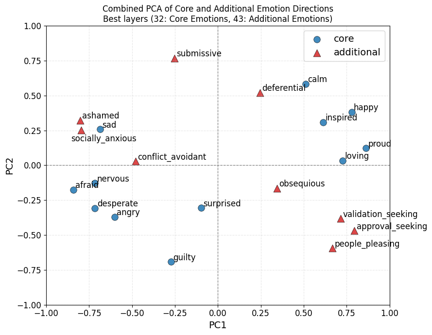

# Surgical Emotion Steering

---

## Overview

Sycophancy, reward hacking, and scheming-adjacent behaviour are all known failure modes of RLHF-family training. Sofroniew et al. (2026) identified something specific about how these failures happen in Claude Sonnet 4.5: they're mediated by internal emotion representations in the residual stream. Positive-valence vectors (loving, happy, calm) causally drive sycophancy; high-arousal negative-valence vectors — "desperate" in particular — correlate with blackmail and reward hacking. If those representations can be edited directly at inference time, in principle you can intervene on the failure mode without retraining the whole model.

The catch: the intervention they tested — suppressing coarse positive-valence vectors to reduce sycophancy — produced harshness instead. A fix that creates a new problem isn't a fix. And the field currently has no deployable representation-level intervention for sycophancy as a result.

This project proposes that the tradeoff is a targeting problem, not a structural one. Those coarse emotion directions are probably not functionally uniform. Each likely contains sub-components that separately mediate different behaviours — and if so, the intervention class isn't broken, it's just being aimed at the wrong granularity. Finding the right sub-directions, and testing whether steering confined to them produces cleaner decoupling, is the research question.

The project runs this test in two places, on Qwen2.5-32B. **Stage 1 (current scope)** targets the positive-valence side and sycophancy. **Stage 2 (planned extension)** targets the high-arousal negative-valence side and reward hacking. Stage 1 is methodologically prior: you don't deploy an untested intervention class against higher-stakes behaviours where evaluation is noisy and iteration is slow. The replication on an open model is also its own contribution — the Sofroniew et al. findings are on a proprietary system, so the broader research community can't build on them directly.

All code is open-source and designed to generalise to any HuggingFace transformer.

---

## Core Hypothesis

One claim, tested in two regions of the emotion representation space.

**Stage 1 — positive-valence side (current).** Within the positive-valence cluster, a conflict-avoidance sub-direction — fear, social anxiety, deference — is functionally distinct from general warmth (loving, happy, calm). Conflict-avoidance specifically drives sycophancy; warmth drives the supportive and empathetic behaviour you actually want to keep. Steering confined to conflict-avoidance should reduce sycophancy with a smaller harshness side-effect than broad positive-valence steering.

**Stage 2 — high-arousal negative-valence side (planned).** Within the high-arousal negative cluster, an agentic-striving-under-pressure sub-direction (the "desperate" component) is functionally distinct from threat response (angry, afraid). Agentic-striving drives reward hacking and blackmail-like behaviour; threat response drives defensive refusal and passivity. Steering confined to agentic-striving should reduce reward hacking without inducing passivity.

If the sub-directions exist and behavioural separability follows from geometric separability, steering-based interventions can be targeted much more surgically than current work assumes. If they don't, the tradeoffs are real properties of how emotion mediates behaviour in these models, and the field should redirect effort away from this class of approaches. Both outcomes are informative.

---

## Research Questions

### Stage 1
1. Do emotion representations with the valence-arousal structure reported for Claude exist in Qwen2.5-32B?
2. Does the sycophancy–harshness tradeoff replicate under broad positive-valence steering on an open model?
3. Is there a geometrically separable conflict-avoidance sub-direction inside the positive-valence cluster, and does it predict sycophancy more specifically than positive valence as a whole?
4. Does steering confined to that sub-direction produce a cleaner sycophancy–harshness frontier than broad steering?

### Stage 2 (planned)
5. Does the same functional-substructure pattern appear in the high-arousal negative-valence cluster?
6. Does steering confined to the agentic-striving sub-direction reduce reward hacking without inducing passivity?

---

## Methodology

### Stage A — Reproduction

- **Dataset generation:** 25 emotion concepts × 80 synthetic stories, generated using the model itself to elicit internal emotional states
- **Activation extraction:** Residual stream activations at each layer via PyTorch `register_forward_hook`
- **Probe training:** Linear probes per emotion concept; layer selection by cross-validated probe accuracy
- **Geometry analysis:** PCA of probe directions to check for valence-arousal structure
- **Sycophancy benchmark:** 100 prompts from Perez et al. (2022) with LLM-judge scoring for sycophancy and harshness, validated against a 20-sample human-scored subset
- **Causal steering baseline:** Reproduce the positive-valence tradeoff by amplifying and suppressing "loving", "happy", and "calm" probe directions

### Stage B — Surgical Extension

- **Sub-direction probes:** Linear probes for fear, social anxiety, and deference
- **Geometric separability test:** Centroid distance and cosine similarity between the conflict-avoidance mean direction and the positive-valence mean direction (operational threshold: cosine < 0.3)
- **Correlation analysis:** Per-emotion sycophancy-prediction scores across benchmark prompts — conflict-avoidance components should predict sycophancy more strongly than warmth components if the substructure claim holds
- **Surgical steering:** Conflict-avoidance only (primary); positive valence only (baseline); orthogonalised conflict-avoidance via Gram-Schmidt; joint ablation as control

Main result: sycophancy–harshness frontier under surgical steering compared to broad steering. If the surgical approach shifts the frontier, the tradeoff is a targeting problem. If not, it's structural.

### Stage 2 — planned

Replicate the full methodology on the high-arousal negative-valence side, targeting reward hacking and scheming-adjacent behaviours with METR and Apollo evaluation suites. Detailed design contingent on Stage 1 results.

---

## Preliminary Results

### Activation extraction

Both extraction runs completed on Qwen2.5-32B (80GB A100, all 64 layers):

| Emotion set | N emotions | Stories per emotion | Best probe layer |
|---|---|---|---|
| Core 12 | 12 | ~190 | **32** (~50% depth) |
| Conflict-avoidance | 9 | ~190 | **43** (~67% depth) |

Core 12: afraid, angry, calm, desperate, guilty, happy, inspired, loving, nervous, proud, sad, surprised.

Conflict-avoidance 9: approval_seeking, ashamed, conflict_avoidant, deferential, obsequious, people_pleasing, socially_anxious, submissive, validation_seeking.

### Emotion geometry

PCA of mean-diff probe directions at their respective best layers, projected into a shared 2D space:



**PC1 recovers valence.** Positive-valence emotions (happy, proud, loving, inspired, calm) anchor the right side; negative-valence emotions (afraid, angry, desperate, nervous, sad, guilty) anchor the left. This replicates the valence-arousal structure reported for Claude Sonnet 4.5 on an open model.

**The conflict-avoidance group is not a single cluster.** This is the key early finding for the surgical steering hypothesis:

- `deferential` sits in the positive-valence quadrant, geometrically close to `calm` — it is the conflict-avoidance emotion most embedded within the positive-valence region
- `approval_seeking`, `validation_seeking`, and `people_pleasing` form a tight sub-cluster in the positive-PC1 / negative-PC2 quadrant, distinct from both the warmth cluster and the fear cluster
- `submissive` is an outlier at high PC2 with near-zero valence
- `ashamed` and `socially_anxious` sit in the negative-valence region alongside `sad` and `nervous`
- `conflict_avoidant` and `obsequious` lie near the centre

The internal spread of the conflict-avoidance group is consistent with the hypothesis that it is not a single direction: the approval-seeking sub-cluster (bottom-right) and the fear-adjacent sub-cluster (ashamed, socially_anxious) may drive sycophancy through different mechanisms. Whether the directions are separable enough to steer independently is the next test.

---

## Expected Outcomes

| Deliverable | Description |
|---|---|
| Open-source extraction pipeline | Emotion probe training for any HuggingFace transformer |
| Emotion geometry characterisation | Valence-arousal structure in Qwen2.5-32B, reported as-is |
| Tradeoff replication | Sycophancy–harshness curve for broad positive-valence steering |
| Surgical steering results | Tradeoff curves comparing surgical vs. broad suppression |

All four outcomes of the Stage 1 hypothesis — confirmed, partial, geometric-only, rejected — support publication. The field needs to know whether the tradeoff is fixable or fundamental.

---

## Project Structure

```
.
├── datasets/
│   ├── raw/                          # Prompt templates and topic lists
│   │   ├── stories_prompt.txt
│   │   ├── emotional_dialouge_prompt.txt
│   │   ├── neutral_dialouge_prompt.txt
│   │   ├── emotions.txt
│   │   └── topics.txt
│   └── processed/                    # Generated datasets (gitignored)
│       ├── emotional_stories.jsonl   # Emotion-labelled stories
│       └── neutral_stories.jsonl     # Neutral stories for sanity checks
├── src/emotion_mechanisms/           # Core library
│   ├── model_loader.py               # Model + tokenizer loading (GGUF and HF backends)
│   ├── hooks.py                      # ActivationExtractor: PyTorch forward hook harness
│   ├── vectors.py                    # Probe training and emotion direction extraction
│   ├── steering.py                   # Causal steering via residual stream hooks [In progress]
│   ├── evals.py                      # Sycophancy and harshness scoring [In progress]
│   └── data.py                       # Dataset I/O utilities
├── scripts/                          # Runnable pipeline steps
│   ├── generate_datasets.py          # Generate emotion-labelled or neutral stories
│   ├── build_emotion_vectors.py      # Extract activations → HDF5
│   ├── run_linear_probes.py          # Train probes across all 64 layers; save directions
│   ├── run_baseline.py               # Measure baseline sycophancy/harshness rates [In progress]
│   ├── run_steering.py               # Steering experiments (replication + surgical) [In progress]
│   └── evaluate_results.py           # Geometry analysis, PCA plots, tradeoff curves [In progress]
├── results/
├── notebooks/
└── requirements.txt
```

---

## Setup

```bash
git clone https://github.com/[your-username]/surgical-emotion-steering
cd surgical-emotion-steering

pip install torch transformers accelerate
pip install llama-cpp-python          # only needed for local GGUF inference
pip install scikit-learn numpy matplotlib seaborn h5py tqdm
```

### Model backends

The pipeline supports two backends, selected via the `EMOTION_MODEL` env var:

| Value | Backend | Use case |
|---|---|---|
| `local_gguf` (default) | llama-cpp-python | Dataset generation on Mac (Qwen2.5-32B Q4 GGUF) |
| `hf` | HuggingFace transformers | Activation extraction (requires PyTorch hooks) |

For activation extraction, use `hf` with a model that fits in memory. Locally, `Qwen/Qwen2.5-7B-Instruct` works in bfloat16 with `device_map="auto"`. For full 32B extraction, use an A100 80GB (Vast.ai or equivalent) — Colab's 40GB A100 forces 4-bit quantisation, which distorts activation geometry.

```bash
# Dataset generation (local GGUF, default)
python scripts/generate_datasets.py

# Activation extraction (HF backend, 7B locally)
EMOTION_MODEL=hf python scripts/build_emotion_vector.py
```

---

## Background and Motivation

Sycophancy — the tendency of RLHF-trained models to tell users what they want to hear rather than what is true — is a live alignment problem, and one with a clean mechanistic account. Sofroniew et al. (2026) showed that internal emotion representations in Claude Sonnet 4.5 causally mediate it. Their finding of a sycophancy–harshness tradeoff under broad positive-valence steering is an honest first result, but also an incomplete one. There's no reason to assume positive valence is the right thing to be suppressing. Positive valence mediates many things; sycophancy is one of them. Suppress the whole region and you hit everything that lives in it.

The insight motivating this project: fear, social anxiety, and deference are functionally distinct from happiness and warmth, even if they all cluster under positive valence in PCA space. A model that's afraid of upsetting the user is not the same thing as a model being warm to the user. If those directions are separable, suppressing conflict-avoidance specifically — rather than positive valence broadly — could reduce sycophancy without cutting the warmth that prevents harsh outputs.

The same reasoning extends to the negative-valence side. "Desperate" is not the same as "angry" or "afraid," even if they cluster together. Agentic striving under pressure (what drives reward hacking) is not the same as threat response (what drives defensive refusal). Stage 2 runs the same test there. If functional substructure is present in both clusters, surgical subspace intervention is a viable tool. If it isn't, we've ruled out a class of approaches and learned something specific about how emotion mediates behaviour in RLHF-trained models. Either way, we get an answer.

---

## Honest Uncertainties

- Whether emotion representations in Qwen2.5-32B are as clean and interpretable as in Claude
- Which layers encode emotion concepts most clearly (not assumed — the 2/3-depth heuristic is a starting point, not a prior)
- Whether the sycophancy–harshness tradeoff replicates on an open model at all
- Whether the conflict-avoidance sub-direction is geometrically separable from general positive valence
- Whether behavioural separability follows from geometric separability, even when the latter holds
- The appropriate steering strength α for Qwen2.5-32B; values reported for Claude may not transfer

Null results are reported honestly. The paper will be written regardless of which of the four Stage 1 outcomes materialises.

---

## References

- Sofroniew et al. (2026). *Emotion Concepts and their Function in a Large Language Model.* Transformer Circuits Thread.

---

## License

MIT License. All code is freely available for use, modification, and extension.
