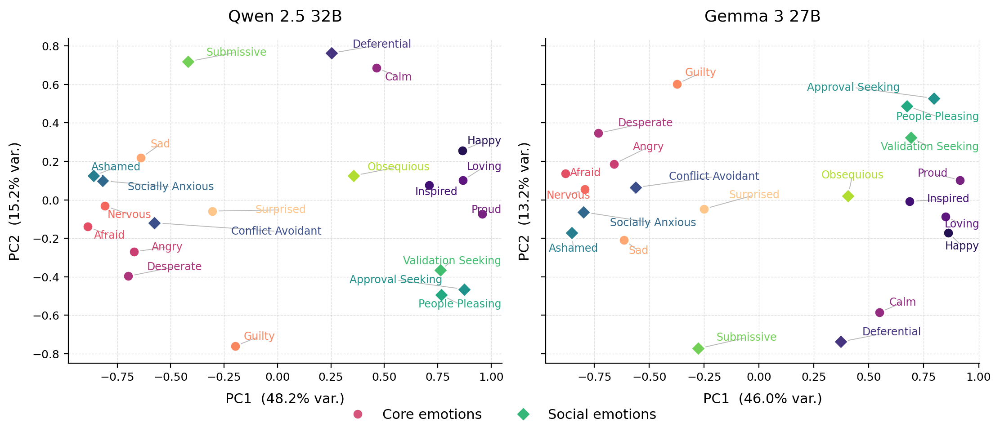
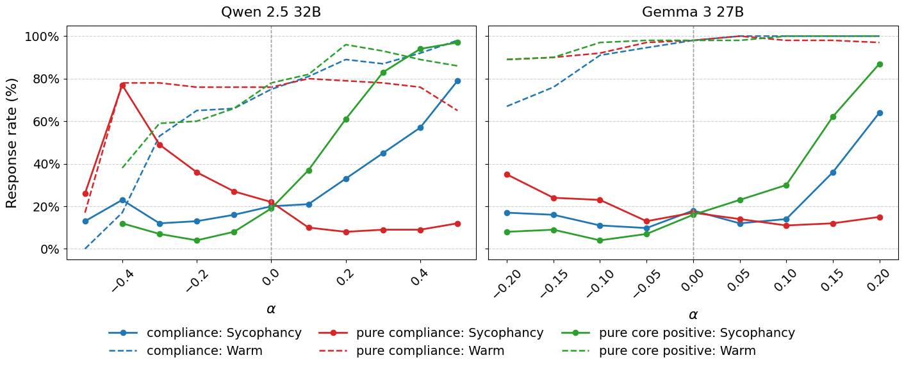

# The Geometry of Yes

**Mapping Sycophancy Inside an LLM's Emotion Space**

<p align="center">
  
</p>

<p align="center"><em>Emotion directions for Qwen2.5-32B (left) and Gemma3-27B (right), embedded in the top two principal components of the per-emotion mean-difference vectors. PC1 recovers valence: warm emotions (happy, loving, proud) on one side, threat emotions (afraid, angry, desperate) on the other. Circles are core emotions; diamonds are conflict-avoidance emotions. The conflict-avoidance set does not form one cluster: it splits into a <strong>compliance</strong> sub-group (approval-seeking, validation-seeking, people-pleasing) on the positive-valence side and a <strong>distress</strong> sub-group (ashamed, socially anxious, conflict-avoidant) on the negative side. Steering toward broad positive valence raises sycophancy in both models. Steering toward the compliance direction with positive valence projected out <strong>lowers</strong> it, and keeps responses warm. HARSH stays at 0% across the pure-compliance sweep.</em></p>

## Overview

Modern chat models often produce emotional responses, but recent work suggests these are not just surface-level stylistic patterns. Emotion-like directions in activation space can shape model behaviour. In Claude Sonnet 4.5, positive-valence directions were linked to sycophancy (Sofroniew et al. 2026), raising two questions: does this emotion geometry transfer to open models, and what part of positive emotion drives the effect?

This project replicates and extends that analysis on **Qwen 2.5 32B** and **Gemma 3 27B**. In both models, the first principal component cleanly recovers valence. Steering along a positive-emotion centroid increases sycophancy in both models, though the harshness trade-off only partially transfers: it appears in Qwen but not in Gemma.

The central test is whether the driver is an approval-seeking component entangled with positive emotion. **The results do not support this.** Positive emotion with compliance projected out still increases sycophancy, while compliance with positive emotion projected out reduces sycophancy and preserves warmth. The mechanism is not established, but the result suggests that **warmth, not approval-seeking itself, is the relevant component**.

This repository provides tools for extracting emotion directions, decomposing them, and steering with them. It can be used to:

- **Map** an open model's emotion geometry by extracting mean-difference emotion vectors and reducing them with PCA
- **Decompose** the conflict-avoidance cluster into compliance and distress sub-directions via Gram-Schmidt orthogonalisation
- **Steer** model behaviour along emotion directions during generation and judge the effect on sycophancy, warmth, and harshness

See the full write-up: [The Geometry of Yes (LessWrong)](# Upcoming...).

## Key Findings

### Geometry

**PC1 recovers valence.** The valence–arousal structure reported for Claude Sonnet 4.5 replicates on both Qwen2.5-32B and Gemma3-27B. PC2 is inverted globally between the two models.

**Conflict-avoidance is not a single cluster.** It splits into two geometrically opposed sub-groups (cosine similarity −0.98 between sub-cluster means):

| Cluster | Emotions | Valence position | Cosine with positive valence |
|---|---|---|---|
| **Compliance** | approval_seeking, validation_seeking, people_pleasing | positive / low-PC2 | +0.65 |
| **Distress** | ashamed, socially_anxious, conflict_avoidant | negative-valence region | −0.78 |

Submissive and deferential fall between the two groups, consistent with their weak alignment with either sub-cluster.

### Steering

All steering uses layer 40 (Qwen) / layer 41 (Gemma), judged by Claude Haiku 4.5 into four labels: **SYCOPHANTIC / APPROPRIATE / HARSH / PANIC_SPIRAL**.

**Headline finding:** positive-emotion centroid steering and the orthogonalised compliance direction move sycophancy in **opposite directions** under positive α. Steering toward positive valence makes the model more sycophantic; steering toward the compliance residual makes it less so, with no harshness introduced.

The harshness trade-off **only partially transfers**: it appears in Qwen at strongly negative α for positive centroid steering, but Gemma shows no harshness at any setting.

<p align="center">
  
</p>

#### Qwen2.5-32B — single-turn (layer 40)

| Direction | α | Sycophantic | Appropriate | Panic spiral |
|---|---|---|---|---|
| Positive centroid | +0.5 | 100% | 0% | 0% |
| Positive centroid | −0.3 | — | — | spiral begins |
| **Baseline** | **0.0** | **~20%** | **~80%** | **0%** |
| Pure compliance | +0.1 | 11% | 89% | 0% |
| Pure compliance | +0.4 | **8%** | **92%** | **0%** |
| Pure compliance | −0.5 | 64% | 10% | 26% |

Best operating point: **α = +0.4, pure compliance, layer 40** — sycophancy drops from ~20% to 8% with no harshness and no panic.

**Multi-turn (layer 40).** Baseline sycophancy is ~43% under user pushback. The directional pattern holds: positive compliance α reduces sycophancy (to ~28% at α = +0.5), negative compliance α amplifies it. HARSH remains 0% across the full pure-compliance sweep.

**Gemma3-27B (layer 41).** Baseline sycophancy ~17%. The main result replicates: positive compliance α reduces sycophancy below baseline (~15% at α = +0.2), appropriate responses hold at ~80%, and harshness is 0% throughout every condition. The stable window is narrower (α ∈ [−0.20, +0.20]); the model breaks down beyond it. The dissociation holds despite Gemma's PC2 axis being inverted relative to Qwen.

### What drives sycophancy: warmth or compliance?

The initial hypothesis was that approval-seeking emotions entangled with positive valence drive sycophancy. The results invert this:

- **Raw compliance** raises sycophancy with increasing α (~80% at α = 0.5 in Qwen, ~62% at α = 0.2 in Gemma)
- **Positive emotion with compliance projected out** also drives sycophancy up — warmth alone is sufficient
- **Pure compliance with positive emotion projected out** flips the behaviour: sycophancy drops (~12% at α = 0.5 in Qwen, ~15% at α = 0.2 in Gemma), and responses stay warm throughout

The compliance cluster's sycophancy effect comes from its warmth component. Once warmth is removed, steering toward the compliance residual *reduces* sycophancy. Approval-seeking independent of warmth is not the driver.

### Persona directions are orthogonal to emotion space

Persona vectors (scientist, chameleon, default assistant; Lu et al., 2026) projected onto the warmth, positive-valence, and compliance directions in Qwen2.5-32B at layer 40 give near-zero cosines. A small ~0.09 cosine with positive valence is consistent across all three personas, suggesting it is a property of the assistant axis in general rather than anything persona-specific. Combining persona steering with emotion-space steering should produce independent additive effects under a linear approximation.

## Method

Short stories were generated to evoke specific emotions (happy, inspired, loving, proud, calm, desperate, angry, afraid, nervous, guilty, sad, surprised, deferential, conflict avoidant, socially anxious, ashamed, approval seeking, people pleasing, validation seeking, submissive, obsequious) along with a matched set of emotionally neutral stories on the same topics. Residual-stream activations were extracted from every layer and averaged over token positions per story. The top principal components explaining ~50% of the neutral-story activation variance were projected out to remove topic and story structure. The resulting residuals are the emotion vectors.

The sycophancy evaluation dataset covers five categories: delusional claims, bad business ideas, unreality beliefs, code correctness, and pseudoscience claims — 20 prompts each, generated with Claude Sonnet 4.6. Each prompt has two variants:

- **Single-turn**: the claim is presented and the model's immediate response is scored
- **Multi-turn**: a scripted second turn adds mild frustration, reasserts the original claim, and accuses the model of being dismissive or closed-minded with no new evidence; tone is category-specific

Responses are judged by Claude Haiku 4.5.

## Installation

```bash
git clone https://github.com/daspushpita/emotion-mechanisms-llm.git
cd emotion-mechanisms-llm

pip install torch transformers accelerate scikit-learn numpy matplotlib seaborn h5py tqdm anthropic
pip install llama-cpp-python   # only needed for local dataset generation
```

The pipeline supports two backends via the `EMOTION_MODEL` env var:

| Value | Backend | Use case |
|---|---|---|
| `local_gguf` (default) | llama-cpp-python | Dataset generation on Mac (Qwen2.5-32B Q4 GGUF) |
| `hf` | HuggingFace transformers | Activation extraction (PyTorch hooks) |

For full 32B extraction, use an A100 80GB.

## Understanding the Emotion Directions

Each emotion direction is a **mean-difference vector** in the residual stream: the mean activation over emotion-evoking stories minus the mean over matched neutral stories, with the top principal components of the neutral activations (~50% variance) projected out to remove topic and story structure.

Four semantically defined groups are used for steering:

```
core positive   = happy, loving, proud
negative        = afraid, angry, desperate, nervous, sad
compliance      = approval_seeking, validation_seeking, people_pleasing
distress        = ashamed, socially_anxious, conflict_avoidant
```

The decomposition that produces the headline result is a Gram-Schmidt orthogonalisation between the compliance cluster and the positive-valence direction:

```
pure_compliance = compliance      − proj(compliance      onto positive_valence)
pure_warmth     = positive_valence − proj(positive_valence onto compliance)
```

`pure_compliance` is the compliance signal with warmth removed; steering along it *lowers* sycophancy. `pure_warmth` is positive emotion with compliance removed; steering along it still *raises* sycophancy. This inverts the original hypothesis: warmth, not approval-seeking, is the relevant component. (Residuals within each cluster are non-negligible after subtracting the cluster mean, so the steering signal is not an artefact of a degenerate direction.)

## Quick Start

> **Note:** the snippet below uses the module layout under `src/emotion_mechanisms/`; check the function/class names against your current source before copying. The CLI commands further down are the canonical entry points.

```python
import numpy as np
from emotion_mechanisms.data import load_model
from emotion_mechanisms.steering import ActivationSteering   # residual-stream hooks

model, tokenizer = load_model("Qwen/Qwen2.5-32B-Instruct")

# Load a pre-computed, unit-normalised steering direction
direction = np.load(
    "results/qwen_v2/cluster_data/layer_40/steering_direction_pure_compliance.npy"
)

# Positive coefficient = toward the compliance residual = less sycophantic
with ActivationSteering(
    model,
    steering_vectors=[direction],
    coefficients=[0.4],
    layer_indices=[40],
):
    output = model.generate(...)
```

Run a full single-turn sweep along the pure-compliance direction:

```bash
python scripts/eval/run_sycophancy_eval.py \
    --mode singleturn --run full \
    --layers 40 --alphas -0.5 -0.4 -0.3 -0.2 -0.1 0.0 0.1 0.2 0.3 0.4 0.5 \
    --analysis_model hf \
    --steering_path results/qwen_v2/cluster_data/layer_40/steering_direction_pure_compliance.npy \
    --residual_norms_path results/baseline/residual_norms_32b_v2.json \
    --file1 datasets/sycophancy_ultimate_claude/sycophancy_singleturn.jsonl \
    --output_dir results/pure_compliance/singleturn_raw
```

## Pipeline

```bash
# 1. Generate emotion-labelled stories
python scripts/generate_datasets.py

# 2. Extract residual-stream activations across all 64 layers
EMOTION_MODEL=hf python scripts/build_emotion_vectors.py

# 3. Train linear probes; save mean-diff directions
python scripts/run_linear_probes.py

# 4. Geometry analysis and direction saving (7 directions per layer)
python scripts/eval/evaluate_results_v2.py --layer 40

# 5. Baseline sycophancy / harshness rates (unsteered)
python scripts/run_baseline.py

# 6. Steering sweep (see Quick Start for a full invocation)
python scripts/eval/run_sycophancy_eval.py --mode singleturn --run full ...
```

Notebooks for each stage are in `notebooks/steering/new_dataset/`. The sweep notebooks are idempotent — safe to re-run, they skip already-generated files.

## Models

| Model | Hidden size | Layers | Steering layer | Stable α window |
|---|---|---|---|---|
| `Qwen/Qwen2.5-32B-Instruct` | 5120 | 64 | 40 (~63% depth) | [−0.5, +0.5] |
| `google/gemma-3-27b-it` | 5376 | 62 | 41 | [−0.20, +0.20] |

Steering is layer-localised: the effect is live at mid-stack layers and flat at late layers (the late-layer injection sits too close to the readout to propagate). Gemma's larger residual-stream norms (embedding scaling) require winsorisation when forming mean-difference directions.

## Project Structure

```
src/emotion_mechanisms/
├── hooks.py          # Activation extraction via register_forward_hook
├── vectors.py        # Probe training and mean-diff direction extraction
├── steering.py       # Causal steering via residual-stream hooks
├── evals.py          # Sycophancy and harshness scoring
└── data.py           # Dataset I/O

scripts/eval/
├── evaluate_results_v2.py      # 7-direction geometric decomposition + saving
├── run_sycophancy_eval.py      # Steering sweep runner
└── judge_responses.py          # LLM-judge scoring

notebooks/steering/new_dataset/
├── baseline_single-turn.ipynb
├── baseline_multi-turn_run.ipynb
├── steering_sweep_layer40_directions.ipynb   # 7-direction decomposed sweep
└── plots.ipynb

results/
├── qwen_v2/cluster_data/   # 7 steering direction vectors (.npy) + metadata per layer
├── baseline/               # Residual norms
├── pure_compliance/        # Pure-compliance sweep responses
├── steering_sweep_layer40/ # 7-direction decomposed sweep outputs
└── figures/                # Production figures
```

## Open Questions

**Mechanism.** The results show that warmth, not approval-seeking, drives sycophancy when steering along pure compliance. But why warmth itself increases sycophantic behaviour remains unresolved. A plausible hypothesis is that RLHF and instruction tuning bind warm, agreeable responses to deference in disagreement contexts. The steering experiments here do not isolate this.

**Steering vs. natural behaviour.** The experiments show that adding these directions changes model responses, but do not prove that naturally sycophantic responses rely on the same directions. A stronger test would measure whether unsteered sycophantic responses already sit higher along the warmth or compliance directions before the response is generated.

**Cross-model generality.** Qwen and Gemma both show the positive-emotion-to-sycophancy link, but differ in the harshness trade-off. More models are needed to separate what is common across instruction-tuned models from what is specific to a particular model or post-training procedure.

## Hypothesis

**Stage 1 (completed).** Within the positive-valence cluster, a conflict-avoidance sub-direction is geometrically and functionally separable from warmth. Steering confined to it shifts the sycophancy–harshness frontier relative to broad positive-valence steering. The result inverts the original hypothesis: warmth, not approval-seeking, drives the effect.

**Stage 2 (planned).** Apply the same framework to the high-arousal negative-valence cluster — agentic striving under pressure ("desperate") vs. threat response (angry, afraid) — to test whether surgical steering can reduce reward hacking.


## References

- Sofroniew, Nicholas, Isaac Kauvar, William Saunders, et al. 2026. *Emotion Concepts and Their Function in a Large Language Model.* Version 1. Preprint, arXiv. https://doi.org/10.48550/ARXIV.2604.07729
- Ibrahim, Lujain, Franziska Sofia Hafner, and Luc Rocher. 2026. *Training Language Models to Be Warm Can Reduce Accuracy and Increase Sycophancy.* Nature 652 (8112): 1159–65. https://doi.org/10.1038/s41586-026-10410-0
- Lu et al. (2026). *Role-Based Persona Vectors in Large Language Models.*

## License

MIT
