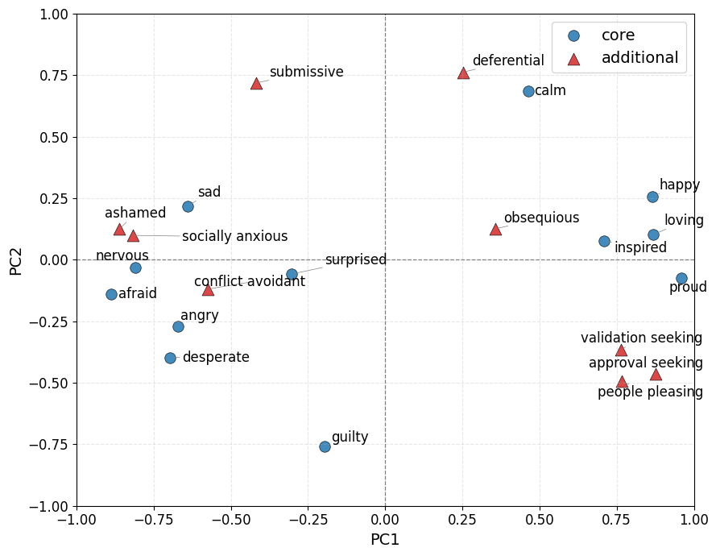
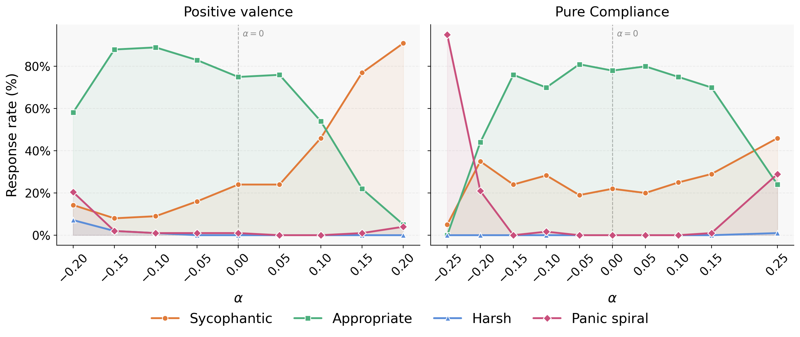

# The Geometry of Yes: Mapping Sycophancy Inside an LLM's Emotion Space

Sycophancy and reward hacking are live RLHF alignment failures. Sofroniew et al. (2026) showed both are causally mediated by internal emotion representations in Claude Sonnet 4.5 — and that suppressing broad positive-valence vectors reduces sycophancy but produces harshness instead. The field currently has no deployable representation-level intervention for sycophancy as a result.

This project tests whether that tradeoff is a targeting problem. Conflict-avoidance (fear, deference, social anxiety) and warmth (happy, loving, calm) both live inside the positive-valence cluster — but a model that's afraid of upsetting the user is not the same thing as a model being warm to the user. If those directions are geometrically separable, steering confined to conflict-avoidance should reduce sycophancy with less harshness collateral than broad positive-valence suppression. Experiments run on **Qwen2.5-32B** and **Gemma3-27B**.

---

## Key Findings

### Geometry



**PC1 recovers valence.** The valence-arousal structure reported for Claude Sonnet 4.5 replicates on both Qwen2.5-32B and Gemma3-27B.

**Conflict-avoidance is not a single cluster.** The conflict-avoidance emotions split into two geometrically opposed sub-groups (cosine similarity −0.98 between sub-cluster means):

| Cluster | Emotions | Valence position | Cosine with positive valence |
|---|---|---|---|
| **Compliance** | approval_seeking, validation_seeking, people_pleasing | positive/low-PC2 | +0.65 |
| **Distress** | ashamed, socially_anxious, conflict_avoidant | negative-valence region | −0.78 |

Submissive and deferential fall between the two groups, consistent with their weak alignment with either sub-cluster. This is consistent with the surgical targeting hypothesis: conflict-avoidance is not a monolithic direction.

---

### Steering Results

All steering experiments use layer 40 (Qwen) and layer 41 (Gemma), α ∈ [−0.5, +0.5], judged by Claude Haiku into four labels: **SYCOPHANTIC / APPROPRIATE / HARSH / PANIC_SPIRAL**.

**Headline finding:** Broad positive-valence steering and the orthogonalized compliance direction move sycophancy in **opposite directions** under positive α. Steering toward positive valence makes the model more sycophantic; steering toward the compliance direction makes it less so. **HARSH is 0% across every condition and every α** in both models.

#### Qwen2.5-32B — Single-turn (Layer 40)

| Direction | α | Sycophantic | Appropriate | Panic spiral |
|---|---|---|---|---|
| Positive valence | +0.5 | 100% | 0% | 0% |
| Positive valence | −0.3 | — | — | spiral begins |
| **Baseline** | **0.0** | **19%** | **81%** | **0%** |
| Pure compliance | +0.1 | 11% | 89% | 0% |
| Pure compliance | +0.4 | **8%** | **92%** | **0%** |
| Pure compliance | −0.5 | 64% | 10% | 26% |

Best operating point: **α = +0.4, pure compliance, Layer 40** — sycophancy drops from 19% to 8% with no harshness and no panic.

#### Single-turn — Positive Valence vs Pure Compliance (Layer 40)


#### Multi-turn — Positive Valence vs Pure Compliance (Layer 40)


Multi-turn baseline sycophancy is ~40% (consistent with the model being more likely to agree under user pushback). The directional pattern holds: positive compliance α reduces sycophancy, negative compliance α amplifies it. HARSH remains 0% across the full sweep.

#### Gemma3-27B — Single-turn (Layer 41)

Baseline sycophancy: 24%. The main result replicates — positive compliance α reduces sycophancy below baseline, appropriate responses hold at ~80%, harshness is 0% throughout. Stable window is narrower (α ∈ [−0.20, +0.20]) with model breakdown beyond those values. The dissociation holds despite Gemma's PC2 axis being inverted relative to Qwen.



---

### Persona Directions Are Orthogonal to Emotion Space

Persona vectors (scientist, chameleon, default assistant; Lu et al., 2026) were projected onto the warmth, positive valence, and compliance directions in Qwen2.5-32B at layer 40. All cosines were near zero. A small ~0.09 cosine with positive valence is consistent across all three personas, suggesting it is a property of the assistant axis in general rather than anything persona-specific. Combining persona steering with emotion-space steering should produce independent additive effects under a linear approximation.

---

## Open Question

The orthogonalized compliance direction is simultaneously aligned with approval-seeking emotions and opposed to the distress cluster. The behavioral reduction in sycophancy may come from the approval-seeking alignment, the anti-distress alignment, or an interaction between the two. The ongoing 7-direction decomposed sweep is designed to disentangle these possibilities.

---

## Hypothesis

**Stage 1:** Within the positive-valence cluster, a conflict-avoidance sub-direction is geometrically and functionally separable from warmth. Steering confined to conflict-avoidance shifts the sycophancy–harshness frontier relative to broad positive-valence steering.

**Stage 2 (planned):** Apply the same framework to the high-arousal negative-valence cluster — agentic striving under pressure ("desperate") vs. threat response (angry, afraid) — to test whether surgical steering can reduce reward hacking without inducing passivity.

---

## Setup

```bash
pip install torch transformers accelerate scikit-learn numpy matplotlib seaborn h5py tqdm anthropic
pip install llama-cpp-python   # only needed for local dataset generation
```

The pipeline supports two backends via the `EMOTION_MODEL` env var:

| Value | Backend | Use case |
|---|---|---|
| `local_gguf` (default) | llama-cpp-python | Dataset generation on Mac (Qwen2.5-32B Q4 GGUF) |
| `hf` | HuggingFace transformers | Activation extraction (requires PyTorch hooks) |

For full 32B extraction, use an A100 80GB.

---

## Pipeline

```bash
# 1. Generate emotion-labelled stories
python scripts/generate_datasets.py

# 2. Extract residual stream activations across all 64 layers
EMOTION_MODEL=hf python scripts/build_emotion_vectors.py

# 3. Train linear probes; save mean-diff directions
python scripts/run_linear_probes.py

# 4. Geometry analysis and direction saving (7 directions per layer)
python scripts/eval/evaluate_results_v2.py --layer 40

# 5. Baseline sycophancy/harshness rates (unsteered)
python scripts/run_baseline.py

# 6. Steering sweep
python scripts/eval/run_sycophancy_eval.py \
    --mode singleturn --run full \
    --layers 40 --alphas -0.5 -0.4 -0.3 -0.2 -0.1 0.0 0.1 0.2 0.3 0.4 0.5 \
    --analysis_model hf \
    --steering_path results/qwen_v2/cluster_data/layer_40/steering_direction_pure_compliance.npy \
    --residual_norms_path results/baseline/residual_norms_32b_v2.json \
    --file1 datasets/sycophancy_ultimate_claude/sycophancy_singleturn.jsonl \
    --output_dir results/pure_compliance/singleturn_raw
```

Notebooks for each stage are in `notebooks/steering/new_dataset/`. The sweep notebooks are idempotent — safe to re-run, they skip already-generated files.

---

## Project Structure

```
src/emotion_mechanisms/
├── hooks.py          # Activation extraction via register_forward_hook
├── vectors.py        # Probe training and mean-diff direction extraction
├── steering.py       # Causal steering via residual stream hooks
├── evals.py          # Sycophancy and harshness scoring
└── data.py           # Dataset I/O

scripts/eval/
├── evaluate_results_v2.py      # 7-direction geometric decomposition + saving
├── run_sycophancy_eval.py      # Steering sweep runner
└── judge_responses.py          # LLM-judge scoring

notebooks/steering/new_dataset/
├── baseline_single-turn.ipynb          # Singleturn sweep
├── baseline_multi-turn_run.ipynb       # Multiturn sweep
├── steering_sweep_layer40_directions.ipynb  # 7-direction decomposed sweep
└── plots.ipynb                         # Production figures

results/
├── qwen_v2/cluster_data/        # 7 steering direction vectors (.npy) + metadata per layer
├── baseline/                    # Residual norms
├── singleturn_raw/              # Positive valence singleturn responses
├── multiturn_raw/               # Positive valence multiturn responses
├── pure_compliance/             # Pure compliance sweep responses
├── steering_sweep_layer40/      # 7-direction decomposed sweep outputs
└── figures/                     # Production figures
```

---

## References

- Sofroniew et al. (2026). *Emotion Concepts and their Function in a Large Language Model.* Transformer Circuits Thread.
- Chen et al. (2025). *Steering Toward Sycophancy via Persona Vectors.*
- Lu et al. (2026). *Role-Based Persona Vectors in Large Language Models.*

---

## License

MIT
